# Invoice Extractor - Extraction de factures PDF avec AWS Bedrock

Outil Python pour extraire automatiquement des informations de factures PDF en utilisant AWS Bedrock (LLM) et les stocker dans DynamoDB.

## 🎯 Fonctionnalités

- **Extraction PDF intelligente** : PyPDF2 + pdfplumber avec fallback automatique
- **Support multi-modèles Bedrock** : Claude 3, Llama 3, Amazon Titan, etc.
- **Configuration AWS intelligente** : Détection automatique région/credentials depuis AWS CLI
- **Intégration S3** : Déclenchement automatique sur dépôt de fichiers
- **Stockage DynamoDB** : Sauvegarde structurée avec indexes optimisés
- **Workflow AWS** : Architecture serverless scalable
- **Parsing robuste** : Extraction JSON même avec texte supplémentaire
- **Normalisation des champs** : Support français/anglais automatique

## 📋 Champs extraits

L'outil extrait les informations suivantes des factures :
- ✅ **Fournisseur** : Nom de la société émettrice
- ✅ **Montant HT** : Montant hors taxes (nombre uniquement)
- ✅ **Numéro de facture** : Identifiant unique de la facture
- ✅ **Date de facture** : Format YYYY-MM-DD
- ✅ **Numéro Chrono** : Numéro chronologique du document
- ✅ **Période de couverture** : Période couverte par la facture
- ✅ **Nom du fichier** : Nom du fichier source

## 🏗️ Architecture

```mermaid
graph TB
    S3[S3 Bucket] -->|Déclencheur| Lambda[AWS Lambda]
    Lambda -->|Extraction texte| PDF[PDF Extractor]
    PDF -->|Texte extrait| Bedrock[AWS Bedrock]
    Bedrock -->|Données structurées| DynamoDB[DynamoDB Table]
    Bedrock -->|Logs| CloudWatch[CloudWatch Logs]
```



## 🚀 Installation rapide

### Prérequis
- Python 3.8+ (⚠️ SAM nécessite Python ≤3.13)
- AWS CLI configuré (`aws configure`)
- Compte AWS avec accès à Bedrock, S3, DynamoDB, Lambda

### Installation en 3 étapes
```bash
# 1. Cloner et installer
git clone <repository-url>
cd invoice-extractor
pip install -r requirements.txt

# 2. Configurer (optionnel - utilise AWS CLI par défaut)
cp config/env.example .env  # Éditer si nécessaire

# 3. Tester
python -m src_propre.main test_factures/votre_facture.pdf
```

## ⚙️ Configuration intelligente

### Détection automatique AWS
L'application détecte automatiquement :
1. **Région AWS** : Variable d'environnement → AWS CLI → us-west-2 par défaut
2. **Credentials** : AWS CLI → Variables d'environnement

### Modèles Bedrock supportés
```python
# Modèles disponibles (configurables via .env ou code)
- Claude 3.5 Sonnet : anthropic.claude-3-5-sonnet-20241022-v2:0
- Claude 3 Haiku : anthropic.claude-3-haiku-20240307-v1:0
- Llama 3.1 70B : meta.llama3-1-70b-instruct-v1:0
- Amazon Titan : amazon.titan-text-express-v1
# + 125 autres modèles disponibles dans us-west-2
```

### Configuration minimale (.env)
```env
# Optionnel - utilise AWS CLI par défaut
AWS_REGION=us-west-2
BEDROCK_MODEL_ID=meta.llama3-1-70b-instruct-v1:0
DYNAMODB_TABLE_NAME=invoices
S3_INPUT_BUCKET=votre-bucket-factures
```

## 🧪 Utilisation

### Test local
```bash
# Extraction simple
python -m src_propre.main chemin/vers/facture.pdf

# Test avec modèle spécifique
python -c "from config.config import Config; Config.set_model('llama-3-1-70b')"
python -m src_propre.main facture.pdf

# Tester différents modèles
python test_models_simple.py
```

### Mode production (Lambda)
L'application est conçue pour fonctionner comme une fonction AWS Lambda déclenchée par S3.

### Structure des données extraites
```json
{
  "fournisseur": "BOARDRIDERS TRADING ESPAÑA SLU",
  "montant_ht": 102.50,
  "numero_facture": "TA7JP0239347",
  "date_facture": "2025-11-19",
  "Le numero Chrono du document": "954669788",
  "La période de couverture": "1 Oct. a 31 Oct.",
  "nom du fichier que tu trouves ici": "2140 1902095741 210515 TELEFONICA MG PLVT.pdf",
  "filename": "2140 1902095741 210515 TELEFONICA MG PLVT.pdf",
  "extraction_date": "2026-01-11T10:45:17.167577",
  "pdf_path": "test_factures/2140 1902095741 210515 TELEFONICA MG PLVT.pdf"
}
```

## 🔧 Fonctionnalités avancées

### Support multi-modèles
Le client Bedrock adapte automatiquement le format de requête selon le modèle :
- **Anthropic Claude** : Format Completions API
- **Meta Llama** : Format spécifique Llama
- **Amazon Titan** : Format Amazon
- **AI21/Cohere** : Formats respectifs

### Parsing robuste
Extraction de JSON même avec :
- Blocs de code ```json ... ```
- Texte supplémentaire avant/après
- Réponses multiples
- Champs en français/anglais

### Normalisation automatique
Les champs sont normalisés automatiquement :
- `fournisseur` ↔ `supplier` ↔ `vendor`
- `montant_ht` ↔ `amount` ↔ `total`
- `numero_facture` ↔ `invoice_number`
- etc.

## 🚀 Déploiement AWS

### ⚠️ Important : Problème SAM avec Python 3.14
AWS SAM CLI a une incompatibilité avec Python 3.14 (Pydantic v1). Solutions :

**Solution A : Utiliser CloudFormation direct (recommandé)**
```bash
# Script de déploiement simplifié
python deploy_with_cloudformation.py
```

**Solution B : Utiliser Python 3.12 pour SAM**
```bash
# Installer Python 3.12, puis :
python3.12 -m venv venv
venv\Scripts\activate  # Windows
pip install aws-sam-cli
sam build
sam deploy --guided
```

**Solution C : Utiliser Docker avec SAM**
```bash
sam build --use-container
sam deploy --guided
```

### Options de déploiement disponibles :

1. **✅ CloudFormation direct** (sans SAM/CDK) - `deploy_with_cloudformation.py`
2. **AWS SAM** - `template.yaml` (nécessite Python ≤3.13)
3. **AWS CDK** - `infrastructure/cdk-stack.py` (nécessite Node.js)
4. **Déploiement manuel** - Voir `DEPLOY.md`

### Déploiement rapide avec CloudFormation
```bash
# 1. Vérifier la configuration AWS
python deploy_with_cloudformation.py

# 2. Choisir l'option 1 (Valider le template)
# 3. Choisir l'option 2 (Créer la stack)
```

## 📊 Coûts estimés

Pour 1000 factures/mois :
- **Bedrock (Llama 3.1 70B)** : ~$2-5
- **Lambda** : ~$0.20
- **S3** : ~$0.50
- **DynamoDB** : ~$1-2
- **Total** : ~$4-8/mois

## 🧪 Tests

### Tests unitaires
```bash
pytest tests/ -v
```

### Tests d'intégration
```bash
# Tester l'extraction complète
python test_real_invoice_simple.py

# Tester différents modèles
python test_models_simple.py

# Lister les modèles disponibles
python list_available_models.py
```

## 🔧 Développement

### Structure du projet
```
invoice-extractor/
├── src_propre/              # Code source propre (à versionner)
│   ├── main.py             # Handler Lambda
│   ├── bedrock_client.py   # Client multi-modèles Bedrock
│   ├── dynamodb_client.py  # Client DynamoDB avec indexes
│   ├── pdf_extractor.py    # Extraction PDF (dual library)
│   └── config.py           # Configuration intelligente
├── config/                 # Configuration
│   ├── config.py          # (copié dans src_propre/)
│   └── env.example        # Template variables d'environnement
├── infrastructure/         # Infrastructure as Code
│   └── cdk-stack.py       # Stack AWS CDK
├── tests/                 # Tests
├── scripts/               # Scripts utilitaires
├── .gitignore            # Fichiers à ignorer pour GitHub
├── cloudformation-template.yaml  # Template CloudFormation
├── template.yaml         # Template AWS SAM
├── deploy_with_cloudformation.py # Script de déploiement
└── requirements.txt      # Dépendances Python
```

### Ajouter un nouveau modèle
1. Ajouter l'ID dans `Config.BEDROCK_AVAILABLE_MODELS`
2. Le client détectera automatiquement le format requis

### Personnaliser l'extraction
1. Modifier le prompt dans `src_propre/bedrock_client.py`
2. Ajouter des mappings dans `_normalize_field_names()`
3. Mettre à jour la validation

## 🆘 Dépannage

### Problèmes courants

1. **"Model access not granted"**
   ```bash
   # Activer l'accès au modèle
   # AWS Console → Bedrock → Model access → Request access
   ```

2. **"Credentials not found"**
   ```bash
   # Configurer AWS CLI
   aws configure
   # Ou créer un fichier .env
   ```

3. **"JSON parsing error"**
   - Le modèle fonctionne mais le format de réponse varie
   - Le parsing amélioré gère la plupart des cas

4. **"sam build échoue avec Python 3.14"**
   ```bash
   # Utiliser CloudFormation direct
   python deploy_with_cloudformation.py
   # Ou installer Python 3.12
   ```

### Logs et monitoring
- **CloudWatch Logs** : `/aws/lambda/invoice-extractor`
- **Métriques** : ExtractionSuccess, ExtractionFailure, ProcessingTime
- **Table DynamoDB** : Vérifier les données extraites

## 📄 Licence

MIT License - voir `LICENSE` pour plus de détails.

## 🤝 Contribution

Les contributions sont les bienvenues ! Voir `CONTRIBUTING.md` pour les guidelines.

## 📞 Support

Pour les problèmes :
1. Vérifier les logs CloudWatch
2. Tester avec `test_models_simple.py`
3. Ouvrir une issue sur GitHub

---

**Dernière mise à jour** : Janvier 2026  
**Version** : 2.0.0  
**Statut** : Production Ready ✅  
**Modèle par défaut** : Llama 3.1 70B (fonctionne sans activation)  
**Compatibilité Python** : 3.8+ (⚠️ SAM nécessite ≤3.13)  
**Options de déploiement** : CloudFormation, SAM, CDK, Manuel
